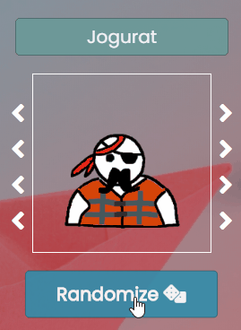
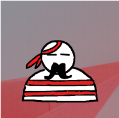
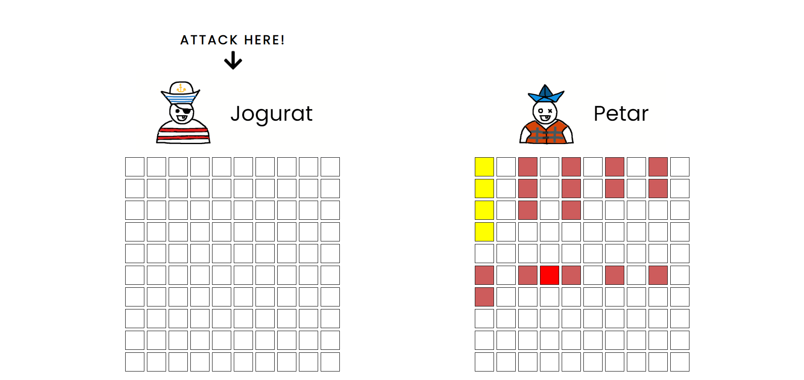
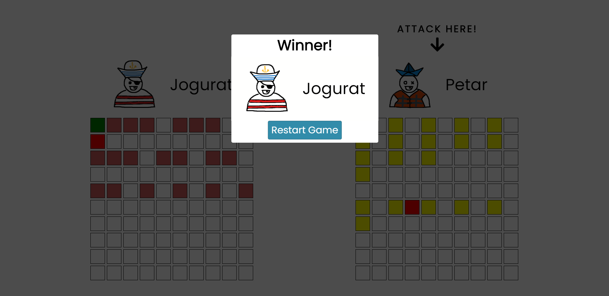

# Battleships

## [Live demo](https://jogurat-battleships.netlify.app/)

This is a small, vanilla HTML, JS and CSS project for a University class - Web Design.

You can see the live demo [here](https://jogurat-battleships.netlify.app/).

It is a couch co-op multiplayer game of Battleships - you have to sink the other players ships.

## Index page

On the first page, you are prompted to select your usernames, as well as your avatars.

The avatar selection is inspired by skribbl.io, all the assets were drawn by me, using an old Wacom tablet. You can change the hat, eyes, mouth and shirt of the avatar. Also, there's a "Randomize" option, which will, you guessed it, randomize your avatar.

The randomization:

Some cute avatars for your satisfaction :)

## Setup page

On the setup page, you are prompted to place your ships. You do this by clicking and dragging your mouse.
You must select the correct amount of ships to go onto the next stage (the game phase).

The red boxes signalize that you cannot place a ship there.

Clicking on an already placed ship will remove it.

Pressing "Save Selection" will take you to the same selection screen, but for the other player. Repeat the same steps.

## Game page

On the game page, you will be prompted to play the game (aha!).

The orange-ish pink tiles represent your ship tiles.
You play by clicking on the tile you wish to sink your enemy on.

When you hit a ship, that tile will turn green, and you can target another tile, until you miss.

When you sink the entire ship, all the tiles of that ship will turn yellow.

When you miss a tile, it will turn red, and the other player's turn will commence.

Once a player hits all the opposing player's ship tiles, that player is deemed the winner!

Here, you can restart the game!

### [Live demo](https://jogurat-battleships.netlify.app/)
